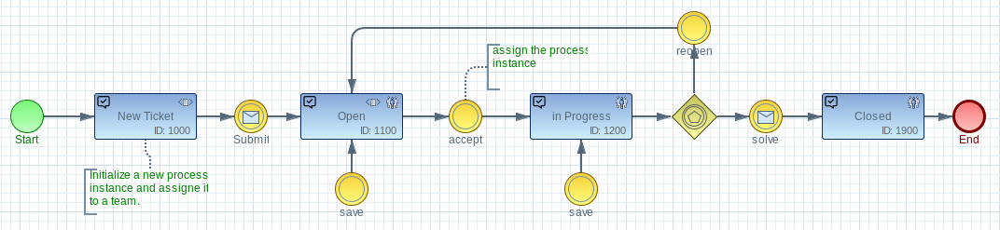

# imixs-mvc-example

The Imixs-mvc-example provides a example of a MVC 1.0 web application integrating the Imixs-Workflow engine.
You can take this application as a scaffolding for your own web business application based on the [Imixs-Workflow project](http://www.imixs.org).

## Build the Application

The application is based on Maven. To build the application artifact form sources run:

	$ mvn clean install

## ozark-resteasy

The example is developed against the application server wildfly. As [MVC 1.0 implementation Ozark](https://github.com/mvc-spec/ozark) is based on Jersey, the web application need to replace the Wildly RestEasy implementation with the Jersey implementation of JAX-RS. This is done by the following additional maven dependency:

	<dependency>
		<groupId>org.mvc-spec.ozark</groupId>
		<artifactId>ozark-resteasy</artifactId>
		<version>1.0.0-m03</version>
	</dependency>
		
To build the applicaiton for Glassfish/Payara use the corresponding jersey dependency:

	<dependency>
		<groupId>org.mvc-spec.ozark</groupId> 
		<artifactId>ozark-jersey</artifactId> 
		<version>1.0.0-m03</version> 
	</dependency> 		
	

  

The Imixs-MVC-Example includes a Docker Container to run the sample application in a Docker container. 
The docker image is based on the docker image [imixs/wildfly](https://hub.docker.com/r/imixs/wildfly/).

To run the MVC Sample Application in a Docker container, the container need to be linked to a postgreSQL database container. The database connection is configured in the Wildfly standalone.xml file and can be customized to any other database system. 

## 1. Build the Docker Image

To build the application together with the docker container run:

	$ mvn clean install -Pdocker-build

 
## 2. Start the Application in a Docker Container

After you have created the docker image, you can start the application. The workflow engine needs a SQL Database. The project contains a pre-configured docker-compose file to start both containers:

	$ docker-compose up

See the docker-compose.yml file for details,

Youc an start the application form your web browser:

	http://localhost:8080/workflow/

The example application provides the following test users:

| User    	| Role 					  | Password |
|-----------|-------------------------|----------|
| admin 	| IMIXS-WORKFLOW-Manager  | admin    |
| alex 		| IMIXS-WORKFLOW-Manager  | alex    |
| marty 	| IMIXS-WORKFLOW-Author   | marty    |
| melman 	| IMIXS-WORKFLOW-Author   | melman    |
| gloria 	| IMIXS-WORKFLOW-Author   | gloria    |
| skipper 	| IMIXS-WORKFLOW-Author   | skipper    |
| private 	| IMIXS-WORKFLOW-Author   | private    |
| rico 		| IMIXS-WORKFLOW-Author   | rico    |

	
	
## 3. Upload the BPMN Model:

The application provides an example BPMN model "ticket". The BPMN Model is part of the project and located under /src/workflow/ticket.bpmn

Before you can create a new ticket within the application, make sure that you have uploaded the ticket BPMN model. To upload the model use the CURL command:

	curl --user admin:adminpassword --request POST -Tsrc/workflow/ticket.bpmn http://localhost:8080/workflow/app/model/bpmn

After you have uploaded the ticket workflow model you can create a team and than start the ticket workflow.

## Development

During development you can use the docker-compose-dev.yml file. This stack maps the src/docker/deployments folder to the wildfly auto deploy directory. 

	$ docker-compose -f docker-compose-dev.yml up
	
you may have to grant the deployment folder first to allow the docker non privileged user to access this location.

	$ sudo chmod 777 src/docker/deployments/
	